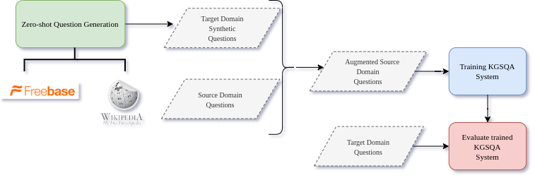

# Knowledge Graph Simple Question Answering for Unseen Domains
<p align="center"></p>

This is the official implementation of the following paper:
Georgios Sidiropoulos, Nikos Voskarides, Evangelos Kanoulas. [Knowledge Graph Simple Question Answering for Unseen Domains](https://arxiv.org/abs/2005.12040). In: Proceedings of AKBC. 2020

## Installation
### Requirements
Our framework requires Python 3.6. The other dependencies are listed in [requirements.txt](requirements.txt).

### Set up 
Run the following commands to clone the repository and install our framework:

```bash
git clone https://github.com/GSidiropoulos/kgsqa_for_unseen_domains.git
cd kgsqa_for_unseen_domains
pip install -r requirements.txt
```
### Download data
Download word embeddings, SimpleQuestions dataset, and data necessary for our framework.
```bash
bash setup.sh
```
## 1. Mention Detection
### Create data for Mention Detection
```bash
python md_data.py --path_load_sq data/SimpleQuestions_v2/ --path_load_mid2ent data/ --target_domain <domain> --path_save <path to MD data output dir>
```

e.g.
```bash
python md_data.py --path_load_sq data/SimpleQuestions_v2/ --path_load_mid2ent data/ --target_domain astronomy --path_save data/md_astronomy/
```

This generates the data we need to train the Mention Detection model. Data are generated under `data/md_astronomy/`

### Train a model for Mention Detection 

```bash
python train_md.py --job_id <slurm job id> --path_load <path to MD output dir> --path_save <path to MD models dir> --model_type <type> --target_domain <domain> --layers 2 --units 600 600 --rec_dropout 0.2 0.2 --dropout 0.4 0  --lr 0.001 --batch_size 300 --max_epochs 50 --save_model
```

e.g.

```bash
python train_md.py --job_id 1 --path_load data/md_astronomy/ --path_save saved_models/md/ --model_type rbilstm --target_domain astronomy --layers 2 --units 600 600 --rec_dropout 0.2 0.2 --dropout 0.4 0  --lr 0.001 --batch_size 300 --max_epochs 1 --save_model
```

Saves the trained MD model under `saved_models/md/1/` and also generates a `data_new.csv` under `data/md_astronomy/test/` and `data/md_astronomy/valid/` which contains the predictions of the MD model.


## 2. Candidate Generation

```bash
python candidate_generation.py --path_load_md_data <path to dir of data_new.csv> --path_load_mid2ent data/ --path_inverted_index data/ --path_save <path to CG output dir>
```

e.g.

```bash
python candidate_generation.py --path_load_md_data data/md_astronomy/test/ --path_load_mid2ent data/ --path_inverted_index data/ --path_save data/md_astronomy/test/
```

This generates the `candidates.pkl` file under `data/md_astronomy/test/`

## 3. Question Generation over KG

### Create Keywords for each relation
Follow the instructions in [create_keywords](create_keywords)

### Generate questions w.r.t keywords
Use the [Zero-shot KGQG](https://github.com/hadyelsahar/Zeroshot-QuestionGeneration). The original work uses as predicate textual context the set of words that appear on the dependency path between the subject and the object
mentions in the sentence. However, in our approach, the predicate textual context is a set of keywords. That said, replace the respective files in [Zero-shot KGQG](https://github.com/hadyelsahar/Zeroshot-QuestionGeneration) with the ones generated in the previous step.
## 4. Relation Prediction

### Create data for Relation Prediction

```bash
python rp_data.py --path_load_sq data/SimpleQuestions_v2/ --path_load_md_data <path to MD data output dir> --path_load_mid2ent data/ --path_load_synthetic <path to synthetic questions> --path_save <path to RP data output dir> --target_domain <domain> --placeholders --use_synthetic_questions
```

e.g.

```bash
python rp_data.py --path_load_sq data/SimpleQuestions_v2/ --path_load_md_data data/md_astronomy/ --path_load_mid2ent data/ --path_load_synthetic daata/synthetic_questions/astronomy_synthetic.csv --path_save data/rp_astronomy/ --target_domain astronomy --placeholders --use_synthetic_questions
```

This generates the data we need to train the Relation Prediction model. Data are generated under `data/rp_astronomy/`

### Train a model for Relation Prediction

```bash
python train_rp.py --job_id <slurm job id> --path_load <path to RP data output dir> --path_save <path to RP models dir> --model_type lstm_words --target_domain <domain> --units 400 --lr 0.001 --batch_size 300 --max_epochs 5 --save_model --path_test_candidates <path to CG output dir> --use_synthetic_questions
```

e.g.

```bash
python train_rp.py --job_id 2 --path_load data/rp_astronomy/ --path_save saved_models/rp/ --model_type lstm_words --target_domain astronomy --units 400 --lr 0.001 --batch_size 300 --max_epochs 5 --save_model --path_test_candidates data/md_astronomy/test/ --use_synthetic_questions --total_negatives 1 --negatives_intersection 1
```

Saves the trained RP model under `saved_models/rp/2/` and also generates `rp_test_results.pkl` which contains the predictions of the RP model.

## 5. Answer Selection
```bash
python answer_selection.py --path_load_gold <path to RP data.csv> --path_cg  <path to candidates.pkl> --path_rp_predictions <path to rp_test_results.pkl> --path_fb data/SimpleQuestions_v2/freebase-subsets/freebase-FB2M.txt --path_pred2ix <path to pred2ix.pkl> --path_ix2pred <path to ix2pred.pkl> --path_mid2entity <path to mid2ent.pkl>
```

e.g.

```bash
python answer_selection.py --path_load_gold data/rp_astronomy/test/data.csv --path_cg  data/md_astronomy/test/candidates.pkl --path_rp_predictions saved_models/rp/2/rp_test_results.pkl --path_fb data/SimpleQuestions_v2/freebase-subsets/freebase-FB2M.txt --path_pred2ix data/rp_astronomy/pred2ix.pkl --path_ix2pred data/rp_astronomy/ix2pred.pkl --path_mid2entity data/mid2ent.pkl
```

QA accuracy w.r.t the predicted object and w.r.t the predicted (subject, relation) pair. 
## Citation
If you find this work helpful or use it in your own work, please cite our paper. 
```
@inproceedings{
sidiropoulos2020knowledge,
title={Knowledge Graph Simple Question Answering for Unseen Domains},
author={Georgios Sidiropoulos and Nikos Voskarides and Evangelos Kanoulas},
booktitle={Automated Knowledge Base Construction},
year={2020},
url={https://openreview.net/forum?id=Ie2Y94Ty8K},
doi={10.24432/C5H01X}
}
```
