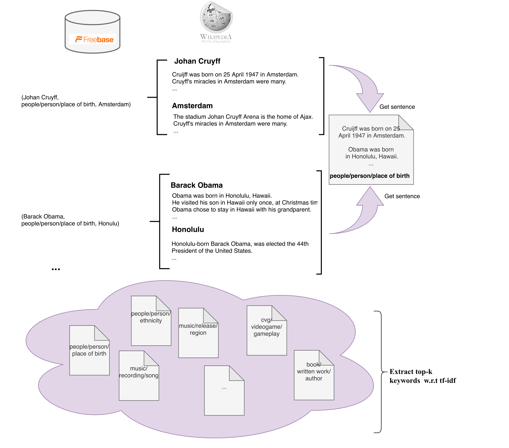

# Extracting Keywords
<p align="center"></p>

## Download data
Download all the data necessary for running steps 1-4.

```bash
bash setup.sh
```

## 1. Splitting DAWT to smaller chunks
Run the cells in `split_dawt.ipynb`. This step needs to be taken in order to create smaller chunk of the 4 partitions of DAWT.
This way, the keyword extraction can be performed in systems with limited CPU power.

## 2. Preprocess DAWT
Preprocess the smaller DAWT chunks which were created in the previous step. Run the cells in `process_dawt_data.ipynb`.

## 3. Sentence Extraction
Extract a set of candidate sentences that express a specific relation between different pairs of entities. Run the cells in `sentence_extraction.ipynb`.

## 4. Keyword Extraction
After extracting the set of sentences, we aim to extract theset of keywords for each relation class. Run the cells in `keywords_extraction.ipynb`. 


## Download intermediate data (step 2) and final data (step 4) 
You can download the appropriate data to run steps 3 and 4 (skipping steps 1 and 2 which are time-consuming).
Moreover, you can use the generated keywords right away skipping all steps.

```bash
bash download_keywords.sh
```
